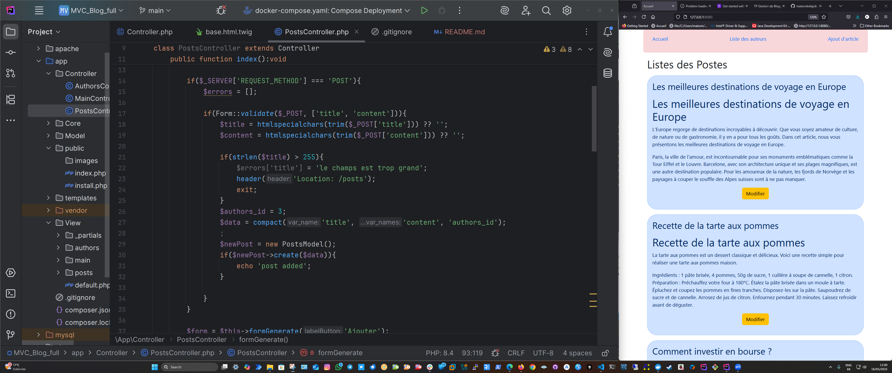

# PHP MVC Framework

This is my first MVC (Model-View-Controller) framework written in **PHP using Object-Oriented Programming**. It is a lightweight and simple structure to help you build web applications by separating concerns: data handling, user interface, and application logic.

## 📸 Screenshot




## 📁 Project Structure


- `public/index.php` – The entry point of the application.
- `core/` – Contains base classes for Controller, Model, and the App router.
- `app/` – Contains your application logic: models, views, and controllers.

## 🚀 Features

- Simple and clean routing system
- MVC architecture
- Easy to scale
- Separation of concerns
- Object-oriented code

## 🛠️ Requirements

- PHP 7.4+
- Web server (Apache/Nginx)
- Composer (optional, if you want to autoload)

## 🧪 How to Use

1. Clone the repository:
   ```bash
   git clone https://github.com/makombelajob/mvc_blog_full.git
